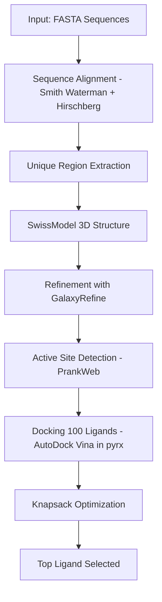
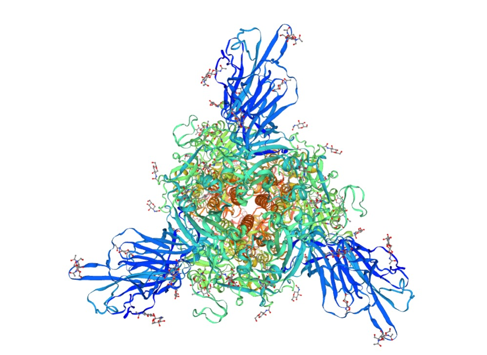
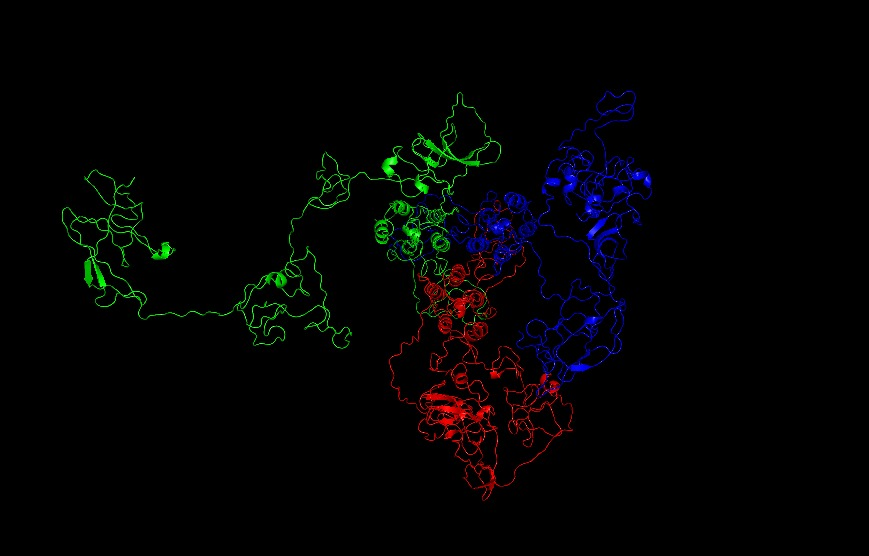
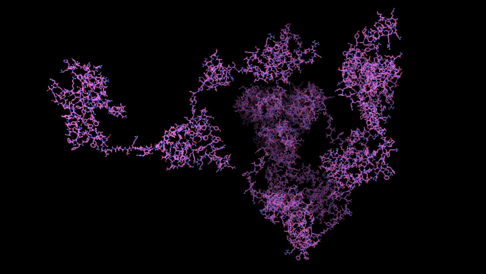
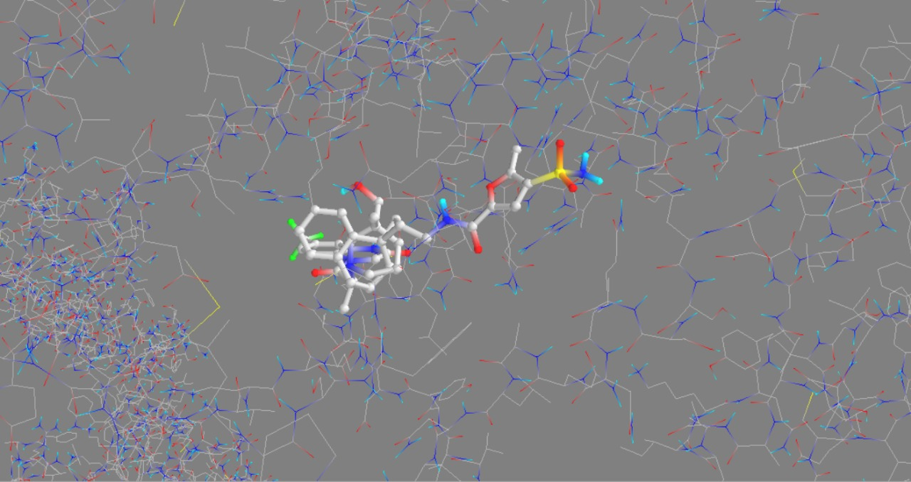
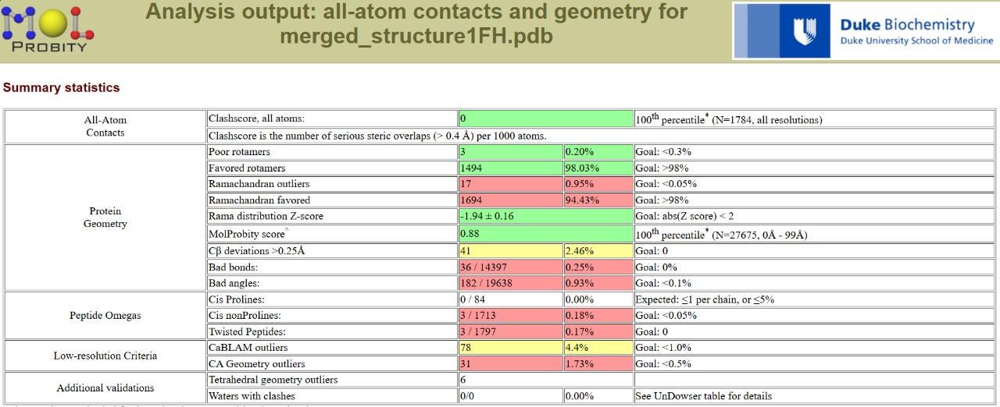
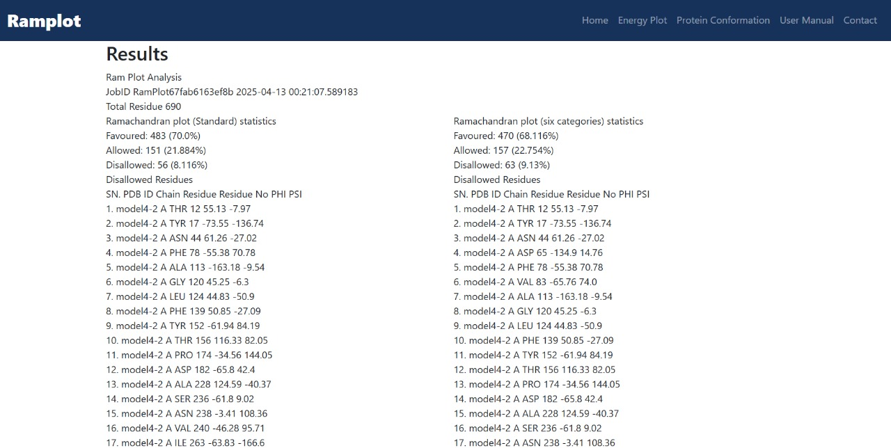
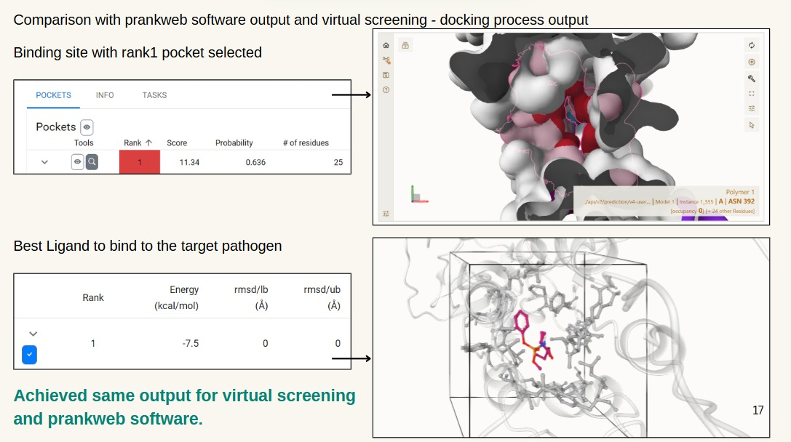

# 🧬 Unique Pathogen Target Classification

This project aims to identify **unique and safe protein targets** in the human proteins by comparing viral proteins to human proteins. The ultimate goal is to discover antiviral ligands that **target virus-specific regions** without causing side effects due to similarity with human proteins.

---

## 🎯 Objective

To build a **bioinformatics and molecular docking pipeline** that:
- Aligns SARS-CoV-2 and human protein sequences
- Identifies unique viral regions in human proteins to avoid side-effects
- Predicts and refines 3D structures of these regions
- Screens antiviral ligands using AutoDock Vina
- Optimizes selection using the Knapsack algorithm

---

## 📁 Project Structure

| Step | Description |
|------|-------------|
| STEP 1 | Dataset Collection & Preprocessing |
| STEP 2 | Sequence Alignment (Human vs Viral proteins) |
| STEP 3 | Unique Viral Sequence Filtering |
| STEP 4 | Protein Structure Modeling (Swiss-Model + GalaxyRefine) |
| STEP 5 | Virtual Screening with 100 ligands (AutoDock Vina + PyRx + PrankWeb) |
| STEP 6 | Ligand Optimization using Knapsack Algorithm |
| STEP 7 | Result Analysis & Ligand Selection |

---

## 🔧 Installation & Prerequisites

### 📦 Software Requirements
- Python 3.8+
- AutoDockTools + AutoDock4
- PyRx or Raccoon2 (for docking)
- Open Babel (for ligand conversion)
- Biopython, NumPy, Pandas, Matplotlib

### 🧪 Install Python Dependencies
```bash
pip install biopython numpy pandas matplotlib
```

> You can install Open Babel from: https://openbabel.org

---

## 🏗️ Setup Instructions

1. **Clone the repository**:
```bash
git clone https://github.com/VikasiniS37/UNIQUE_PATHOGEN_TARGET_CLASSIFICATION.git
cd UNIQUE_PATHOGEN_TARGET_CLASSIFICATION.git
```

2. **Add your files**:
```bash
Place `.fasta` files into the `data/` directory.
Add all ligand `.pdbqt` files into `data/ligands/`.
Add `final_model.pdbqt` to `results/`.
```

4. **Run the notebook**:
```bash
Open `notebook/code3.ipynb` and follow each step to reproduce preprocessing, alignment, filtering, and structure selection.
```

5. **Docking Setup**:
```bash
Use `PyRx` or `Raccoon2` with:
Receptor: `final_model.pdbqt`
Ligands: in `data/ligands/`
Grid Box: centered at predicted site (from PrankWeb)
Run AutoDock Vina for batch virtual screening
```
---

## 🔁 Project Workflow



---

## 📊 How It Works

- Protein sequences of SARS-CoV-2 were aligned with human proteins using **Smith-Waterman** (local) and **Hirschberg** (global) alignment.
- Regions with **low similarity** were extracted as **unique viral targets**.
- Structural models of these targets were created using **Swiss-Model** and refined via **GalaxyRefine**.
- Active site coordinates were identified using **PrankWeb**.
- About **100 ligands** from **ZINC15** were docked using **AutoDock Vina**.
- Final ligand selection was optimized using a **Knapsack algorithm** considering binding affinity and RMSD.

---

## 🧪 Datasets

- **Human Protein**: [POTE ankyrin domain family B3](https://www.uniprot.org/uniprotkb/A0JP26/entry)
- **Virus Protein**: [SARS-CoV-2 Spike Glycoprotein](https://www.uniprot.org/uniprotkb/P0DTC2/entry)
- **Ligands**: ~100 antiviral compounds from [ZINC15](https://zinc15.docking.org)

---

## 🧩 Docking Results

✅ Best Ligand: `ZINC000151425092`  
✅ Binding Affinity: `-7.5 kcal/mol`  
✅ RMSD: `0.0 Å` (Perfect Pose)  
✅ Final Protein Structure: `0% clash score` (Refined using GalaxyRefine)

---

## 📦 Outputs

- Refined 3D Structure (`final_model.pdbqt`)
- Docking results (`docking_output.csv`)
- Predicted binding pocket coordinates
- Knapsack-based ligand ranking

## Screenshots 📸
<table>
  <tr>
    <td></td>
    <td></td>
  </tr>
  <tr>
    <td></td>
    <td></td>
  </tr>
  <tr>
    <td></td>
    <td></td>
  </tr>
  <tr>
    <td></td>
    <td></td>
  </tr>
</table>

To upload results:
```bash
mkdir results
cp docking_output.csv results/
cp final_model.pdbqt results/
cp best_ligand_pose.pdbqt results/
```
---
## 🔮 Future Enhancements

- Scale the analysis to the **entire human proteome (~3 million sequences)** to ensure zero off-target overlap.
- Integrate **molecular wet-lab docking and testing** for in-vitro validation of top ligands.
- Automate the entire pipeline as a bioinformatics toolkit or web server.

---

## 📌 References

- [UniProt](https://www.uniprot.org)
- [ZINC15](https://zinc15.docking.org)
- [Swiss-Model](https://swissmodel.expasy.org)
- [I-TASSER](https://zhanggroup.org/I-TASSER/)
- [PrankWeb](https://prankweb.cz)
- [AutoDock Tools](https://autodock.scripps.edu)

---

## 📬 Contact

For queries, reach out via GitHub Issues.
